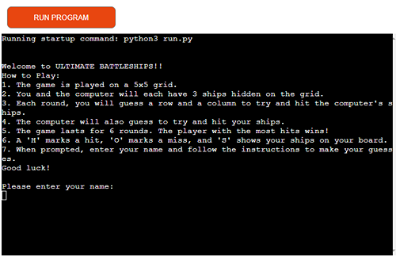
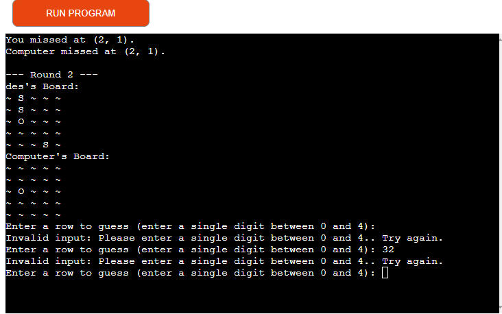
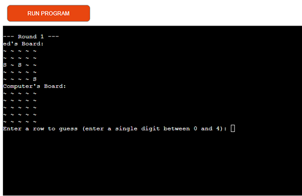

## Introduction

**ULTIMATE BATTLESHIPS** is a Python terminal game designed to run in the Code Institute mock terminal on Heroku. In this strategic guessing game, you will challenge a computer opponent, racing to find and destroy all of its battleships before it finds yours. Each battleship occupies a single square on the 5x5 grid, and the game tests your strategic thinking as you take turns with the computer, guessing the locations of each other's hidden ships. Will you outmaneuver the computer and lead your fleet to victory?

## How to Play

1. **Start the Game:**
   - When you start the game, you'll be prompted to enter your name. This helps personalize the experience and keeps track of your performance against the computer.

2. **Setup:**
   - Both you and the computer will have a 5x5 grid where you place three battleships each. The locations of these ships are hidden from your opponent.

3. **Taking Turns:**
   - The game is played in turns. On your turn, you will guess a row and column to try and locate the computer's ships.
   - The computer will also take turns guessing the locations of your ships.

4. **Guessing:**
   - Enter your guesses as single digits between 0 and 4 for both rows and columns. For example, to guess the square in the third row and second column, you would input `2` for the row and `1` for the column.
   - The game will indicate whether your guess was a hit or a miss.

5. **Scoring:**
   - A hit means you’ve successfully guessed a ship's location. A miss means the guessed location is empty.
   - The goal is to sink all of the computer's ships before it sinks all of yours.

6. **Winning:**
   - The game continues until one player sinks all of the opponent’s ships. If you manage to sink all the computer's ships first, you win!

7. **Replay:**
   - After the game ends, you’ll have the option to play again or exit. Follow the on-screen prompts to make your choice.

### Features

#### Random Board Generation

The game automatically generates a 5x5 grid board with battleships randomly placed. Each battleship occupies a single square on the grid, and the placement is different each time you play. Below is an illustration of a typical board setup:

This feature ensures that each game offers a new challenge, keeping the experience fresh and engaging.

### Player and Computer Engagement

**Engaging with the Computer:**  
In Ultimate Battleships, both you and the computer take turns guessing the location of each other's ships. The computer's moves are unpredictable, adding an element of surprise and challenge to every game. Your strategic thinking and careful guessing are crucial as you try to outsmart the computer and sink its fleet before it sinks yours.

                                                                                                                                                                                              
                                                                                                                                                                                              
                                                                                                                                                                                              
                                                                                                                                                                                              
                                                                                                                                                                                              
                                                                                                                                                                                              
                                                                                                                                                                                              
                                                                                                                                                                                              
                                                                                                                                                                                              
                                                                                                                                                                                              
                                                                                                                                                                                              
                                                                                                                                                                                              
                                                                                                                                                                                              
                                                                                                                                                                                              
                                                                                                                                                                                              
