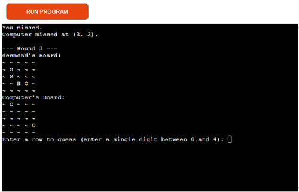
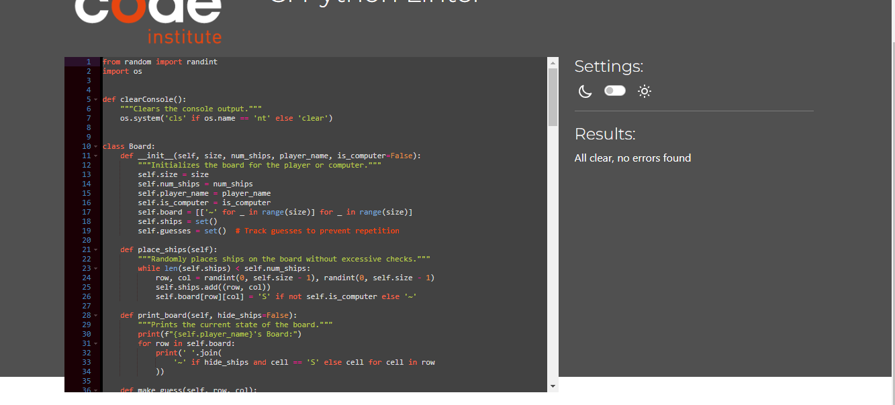

## Introduction

**ULTIMATE BATTLESHIPS** is a Python terminal game designed to run in the Code Institute mock terminal on Heroku. In this strategic guessing game, you will challenge a computer opponent, racing to find and destroy all of its battleships before it finds yours. Each battleship occupies a single square on the 5x5 grid, and the game tests your strategic thinking as you take turns with the computer, guessing the locations of each other's hidden ships. Will you outmaneuver the computer and lead your fleet to victory?

## How to Play


1. **Start the Game:**
   - When you start the game, you'll be prompted to enter your name. This helps personalize the experience and keeps track of your performance against the computer.

2. **Setup:**
   - Both you and the computer will have a 5x5 grid where you place three battleships each. The locations of these ships are hidden from your opponent.

3. **Taking Turns:**
   - The game is played in turns. On your turn, you will guess a row and column to try and locate the computer's ships.
   - The computer will also take turns guessing the locations of your ships.

4. **Guessing:**
   - Enter your guesses as single digits between 0 and 4 for both rows and columns. For example, to guess the square in the third row and second column, you would input `2` for the row and `1` for the column.
   - The game will indicate whether your guess was a hit or a miss.

5. **Scoring:**
   - A hit means you’ve successfully guessed a ship's location. A miss means the guessed location is empty.
   - The goal is to sink all of the computer's ships before it sinks all of yours.

6. **Winning:**
   - The game continues until one player sinks all of the opponent’s ships. If you manage to sink all the computer's ships first, you win!

7. **Replay:**
   - After the game ends, you’ll have the option to play again or exit. Follow the on-screen prompts to make your choice.

### Features

#### Random Board Generation

The game automatically generates a 5x5 grid board with battleships randomly placed. Each battleship occupies a single square on the grid, and the placement is different each time you play. Below is an illustration of a typical board setup:


This feature ensures that each game offers a new challenge, keeping the experience fresh and engaging.

### Player and Computer Engagement

**Engaging with the Computer:**  
In Ultimate Battleships, both you and the computer take turns guessing the location of each other's ships. The computer's moves are unpredictable, adding an element of surprise and challenge to every game. Your strategic thinking and careful guessing are crucial as you try to outsmart the computer and sink its fleet before it sinks yours.


### Gameplay Interaction

In **ULTIMATE BATTLESHIPS**, the player and the computer take turns guessing the locations of each other's battleships. The game provides feedback after each guess, indicating whether it was a hit or a miss. 

The screenshot below shows a typical turn, where both the player and the computer make their guesses and receive instant feedback on their success.



### Future Features


1. **Multiplayer Mode**: Local and online play options.
2. **Customizable Settings**: Adjustable grid size, number of ships, and ship types.
3. **Improved UI**: Color coding, sound effects, and visual enhancements.
4. **Game Statistics**: Leaderboards and match history.
5. **Tutorial Mode**: Interactive guide for new players.
6. **Game Modes**: Campaign and survival modes.
7. **Ship Placement**: Random and manual placement with rotation options.
8. **User Profiles**: Save profiles, stats, and achievements.
9. **Interactive Elements**: Power-ups and event systems.

### Data Model

**Player**
- **name**: `String` - The name of the player, used to identify them during the game.
- **score**: `Integer` - The player's score, representing the number of successful hits on the opponent's ships.
- **board**: `Board` - The `Board` object that represents the grid where the player's ships are placed and where they make guesses.
- **ships**: `Set of Tuples` - A set containing the coordinates of the player's ships on the board. Each tuple represents the row and column of a ship.

**Board**
- **size**: `Integer` - The size of the board (e.g., 5 for a 5x5 grid).
- **num_ships**: `Integer` - The number of ships to be placed on the board.
- **player_name**: `String` - The name of the player who owns this board.
- **is_computer**: `Boolean` - Indicates whether this board belongs to the computer opponent.
- **board**: `List of Lists` - A 2D list representing the board grid, where each cell can contain a ship ('S'), a hit ('H'), a miss ('O'), or be empty ('~').
- **ships**: `Set of Tuples` - A set of coordinates where ships are placed on the board.
- **guesses**: `Set of Tuples` - A set of coordinates where guesses have been made to prevent repeated guesses.

### Function Attributes

**place_ships**
- Places the ships randomly on the board. For the player's board, ships are visible. For the computer's board, ships are hidden.

**print_board**
- Displays the current state of the board. For the computer's board, ships are hidden during gameplay, but the player can see their own ships.

**make_guess**
- Takes a row and column as input, checks if the guess has already been made, and updates the board based on whether the guess was a hit or a miss.

**get_valid_guess**
- Prompts the player to enter a valid guess (row and column) and ensures the input is within the board's boundaries and not a repeated guess.

**get_valid_name**
- Prompts the player to enter a valid name, ensuring it is not empty or a single character and consists of alphabetical characters only.

**display_instructions**
- Prints out the game instructions and rules to guide the player on how to play the game.

**main_game**
- Manages the overall game flow, including setting up the boards, managing rounds, processing guesses, and determining the final winner.

**play_again**
- Asks the player if they want to play another round after the game ends and handles restarting the game or exiting.

### Testing

The project has been manually tested through the following methods:

1. **PEP8 Linting**: The code was passed through a PEP8 linter, and issues such as long line errors were addressed and fixed.


2. **Input Validation**: Various invalid inputs were tested, and the following were successfully handled:
   - Empty entries
   - Strings where numbers are expected
   - Out-of-bounds inputs

3. **Terminal Testing**: The game was successfully tested in both:
   - The local terminal
   - The Code Institute Heroku terminal

These tests ensured the functionality and robustness of the game across different environments and input scenarios.

### Bugs

#### Solved Bugs

1. **PEP8 Issues**: Fixed various PEP8 linter issues, including long line errors and code formatting problems.

2. **Input Validation Errors**: Addressed bugs related to invalid inputs, such as:
   - Handling empty entries.
   - Managing cases where strings were provided instead of numbers.
   - Correctly dealing with out-of-bounds and repeated integer inputs.

3. **Terminal Compatibility**: Resolved issues encountered in different terminal environments, ensuring consistent behavior in both the local terminal and the Code Institute Heroku terminal.

These fixes have improved the overall stability and user experience of the game.

### Remaining Bugs

- **No bugs remaining**: All known issues have been addressed and resolved.

### Validation Testing

- **PEP8 Compliance**: No errors were returned from pep8ci.herokuapp.com, indicating that the code adheres to PEP8 standards.


### Deployment

This project was deployed using Code Institute's mock terminal for Heroku. Follow these steps to deploy the project:

1. **Fork or Clone the Repository**: Create a copy of this repository by either forking it on GitHub or cloning it to your local machine.

2. **Create a New Heroku App**: Log in to your Heroku account and create a new app.

3. **Set Buildpacks**: Configure the buildpacks for the Heroku app:
   - Set the first buildpack to **Python**.
   - Set the second buildpack to **NodeJS**.

4. **Link the Heroku App to the Repository**: Connect your Heroku app to the GitHub repository.

5. **Deploy the App**: Click the **Deploy** button to deploy your project.

These steps will set up and deploy the project on Heroku, making it accessible online.

### Credits

- **Code Institute**: For providing the deployment terminal used for this project.
- **Wikipedia**:https://en.wikipedia.org/wiki/Battleship_(game) For details and background information on the Ultimate Battleships game.
- **Love Sandwiches Walkthrough Project**: For serving as a foundational example for this project.
- **Hints from the Portfolio Project 3 Scope Video**: For valuable insights and guidance.
- **Mentor Calls**: For feedback and support throughout the development process.
- **Google Search**: For additional help and resources during development. https://www.w3schools.com/PYTHON/python_dictionaries.asp
- **DelftStack**: For the code snippet used to clear the console: copy https://www.delftstack.com/howto/python/python-clear-console/#google_vignette
  ```python
  import os
  def clearConsole():
      """
      Clears the console output.
      """
      os.system('cls' if os.name == 'nt' else 'clear')


                                                                                                                                                                                              
                                                                                                                                                                                              
                                                                                                                                                                                              
                                                                                                                                                                                              
                                                                                                                                                                                              
                                                                                                                                                                                              
                                                                                                                                                                                              
                                                                                                                                                                                              
                                                                                                                                                                                              
                                                                                                                                                                                              
                                                                                                                                                                                              
                                                                                                                                                                                              
                                                                                                                                                                                              
                                                                                                                                                                                              
                                                                                                                                                                                              
